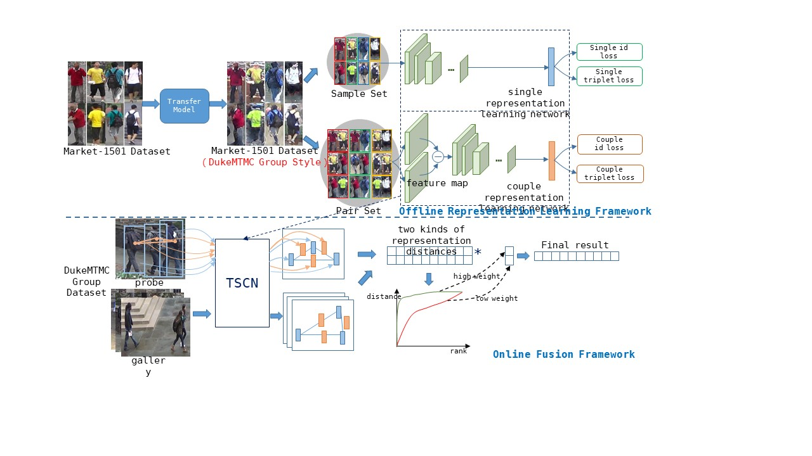

# Group Re-identification Based on Single and Couple Representation Learning
**Abstract:** Group re-identification (G-ReID) is a less-studied task. Its challenges not only lie in appearance changes of individuals which have been well-investigated in general person re-identification (ReID), but also derive from group layout and membership changes. So the key task of G-ReID is to learn representations robust to the changes. To address this issue, we design a Transferred Single and Couple Representation Learning Network (TSCN). The merits are two aspects: 1) Due to the lack of training samples, existing methods exploit unsatisfactory hand-crafted features. To obtain the superiority of deep learning models, we treat a group as multiple persons and transfer the labeled ReID dataset to the G-ReID dataset style to learn the single representation. 2) Taking into account neighborhood relationship in a group, we also propose the couple representation, which maintains more discriminative features in some cases. In addition, an unsupervised weight learning method is exploited to adaptively fuse the results of different views together according to the result pattern. 

## Framework
The proposed architecture consists of two parts: the offline representation learning framework and the online fusion framework. Here, we take DukeMTMC group dataset as the example target-domain dataset. In offline representation learning, we first transfer the style of source-domain dataset (\eg, Market-1501) to that of the target one (\eg, DuketMTMC). We then train the Transferred Single and Couple Network (TSCN) on the transferred labeled dataset. During online funsion, TSCN extracts multiple single and couple features from each group image, and then measure the single and couple representation distance compared to the representations of gallery groups. Through evaluating the ``L'' shape fitness of the curves, we learn the weights for combination. Finally, the fusion results are obtained according to the weights.

## Implement
  - Use CycleGAN to transfer the style of market1501 into group-style dataset.
  - The transferred data should be saved in **single/data/market1501** and **couple/data/market1501**
  - Single representation network can be implemented as:  
    `cd single`  
    `python3 main.py -d market1501 --logs-dir logs/market1501`
  - Couple representation network can be implemented as:  
    `cd couple `  
    `python3 main.py -d market1501 --logs-dir logs/market1501 `
